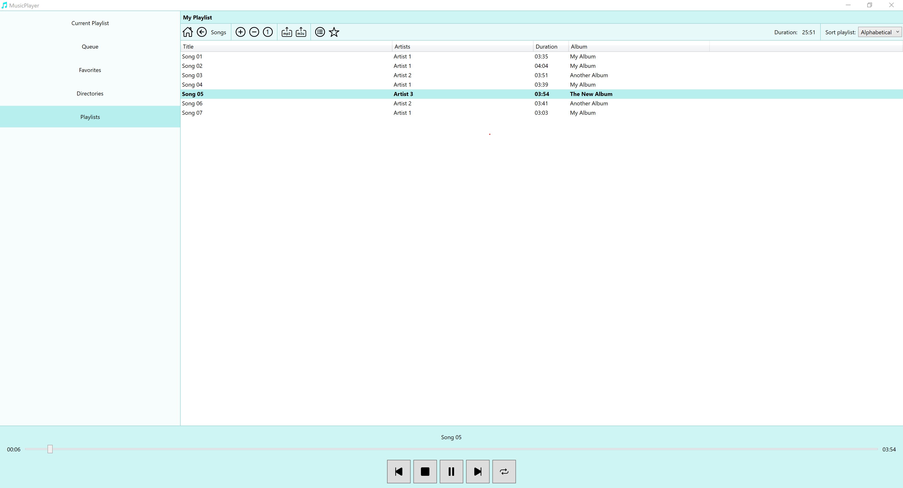

MusicPlayer
===========

Introduction
------------

This WPF application lets the user play music and provides useful features like creating playlists, choosing multiple 
playlists to play in a row and else.

__An overview of the application features:__

* Create playlists (including copying existing playlists and managing playlists in a directory structure).

* Navigate through playlists and 'normal' directories. The 'normal' directories can be added as root directories 
  in the 'Directory' view of the application. So, navigating will be much faster than going via the device's explorer.

* Add playlists or directories to favorites.

* Use queues to play multiple playlists or directories in a row.

* Repeat the current playlist or directory. If the queue contains any playlist (or directory), only the last one will
  be repeated after playing the last song.

* Export playlists to a directory (e.g. to copy it on a USB device).

* Sort the playlists alphabetically, individually or by title number. This sort order can be applied to each playlist
  separately so that you can e.g. have one playlist sorted individually while the others are sorted alphabetically.

Screenshot
----------



Included dependencies
---------------------

| Dependency                   | Version | Notes                                               |
|------------------------------|---------|-----------------------------------------------------|
| .NET                         | 7       |                                                     |
| Microsoft.Xaml.Behaviors.Wpf | 1.1.39  | Used for binding commands to WPF ListView           |
| SharpVectors                 | 1.8.0   | Used for easy displaying SVG images (for the icons) |
| TagLibSharp                  | 2.3.0   | Used for accessing the meta data of music files     |

Configuration
-------------

The required configuration files will be added next to the application and are created automatically when running
the application.

If you want to edit the playlists automatically (e.g. after renaming an root music directory), you can find the
playlist configuration files providing the exact paths to the single songs next to the application file inside the
'Playlist' directory. This directory matches exactly the structure of the 'Playlists' view inside the application.

Structure
---------

The application code contains the following projects:

* Common
* Dialog
* Model
* Start
* View
* ViewModel

In the following, the usage of each project is outlined.

### The Common project

The Common project contains utils which are used by multiple other projects. 
E.g. the LanguageUtil for loading the correct localized strings is placed here.

### The Dialog project

The Dialog project contains the logic to show the View of a dialog and connect it with the related ViewModel. 

This logic is placed inside the separate Dialog project since usual the ViewModel should have __no__ access to
the View package. However, by dynamically opening dialogs from within the ViewModel (e.g. when a special command is 
executed), the ViewModel in fact needs this access. Thus, to hold the coupling as low as possible, the separate
Dialog project is used as a connector between the ViewModel and the View.

So, the dependency looks like this: ViewModel => Dialog => View.

Be aware that the ViewModel objects are not strongly typed but only used with the `object` type inside this project.
This is necessary to avoid cyclic dependencies since the Dialog project is already required by the ViewModel.

### The Model project

The Model project contains the basic data types and services containing the business logic of the application.

The Model classes will be used by the ViewModel to manipulate the data according to the user's wish which is triggered
by the user's actions in the GUI.

### The Start project

The Start project contains the project resources (i.e. icons, localized strings, styles etc.) and the logic for
starting the application. 

Here, the MainWindow is declared and the MainWindowViewModel gets initialized by the 
[MainWindow CodeBehind](Start/MainWindow.xaml.cs). Because of this connection of the View and the ViewModel the 
MainWindow has to be placed inside the Start project and not separated into the View and ViewModel projects.

### The View project

The View project contains the GUI declaration of the application. It does __not__ know the ViewModel project but
uses bindings to get the runtime values and actions.

### The ViewModel project

The ViewModel manages the presentation logic of the View project but has no direct access to the view.
Instead, the View is connected on runtime by bindings to the ViewModel's data and actions.

As an example, the actions triggered by the user in the GUI are declared here.

Build and use the application
-----------------------------

Inside the solutions root (in the directory where this README is placed), run the following command to create
a single file application:

```
dotnet publish Start `
     -c=Release -r=win-x64 `
     -o ./publish `
     --self-contained=true `
     -p:PublishReadyToRun=true `
     -p:PublishSingleFile=true `
     -p:IncludeNativeLibrariesForSelfExtract=true `
     -p:DebugType=None `
     -p:DebugSymbols=false
```

You can just start the application in place without doing any configurations. All required configuration files will
be created automatically when running the application.

__Notes to the `dotnet publish` command:__

* Explicitly name the Start project in the statement because else .NET tries to create a single file EXE for all
  projects. (This will fail anyway since the other projects are no executable applications.)

* Do __not__ use the flag `-p:PublishTrimmed=true` since it does not work with WPF.